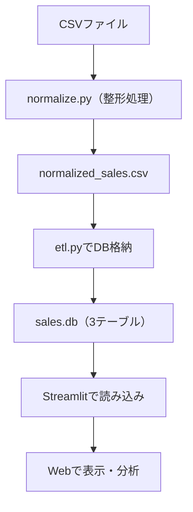

# 🧾 売上データETL＋可視化パイプライン

複数店舗から届く形式バラバラな売上CSVを自動で整形・統合し、SQLiteに格納。  
非エンジニアでも使える、**売上CSVの整形〜可視化**を1クリックで実現する軽量ETLダッシュボード。
Streamlitで可視化することで、**非エンジニアでも売上状況を簡単に確認できるWebアプリ**を構築しました。

---

## 📌 背景と目的

- 小売や飲食などの複数店舗運営では、各店舗から異なる形式の売上CSVが提出され、日付・列名・商品名の表記ゆれが発生します。 
- Excelで約30分かかっていた整形・確認・集計作業を、スクリプトで数秒に短縮
手作業による入力ミスもゼロに近づけ、業務の属人化を解消
- 「整形 → 格納 → 可視化」の流れを自動化し、属人化を解消

---

## 🛠 使用技術

- Python（pandas）
- SQLite
- Streamlit
- Altair
- Mermaid（構成図作成）

---

## 📁 ディレクトリ構成

Sales-etl-streamlit/
├── data/ # 元データCSV格納用
├── db/ # SQLite DB格納先
├── normalize.py # CSV整形スクリプト
├── etl.py # DB格納スクリプト
├── app.py # Streamlitアプリ
├── requirements.txt # 使用ライブラリ一覧
└── README.md # 本ドキュメント

---

## 🔄 処理フロー

## 🚀 実行方法
 1. リポジトリをクローン
git clone https://github.com/flopsy212/Sales-etl-streamlit.git
cd Sales-etl-streamlit

 2. 必要なライブラリをインストール
pip install -r requirements.txt

 3. データ整形（CSV → 正規化CSV）
python normalize.py

 4. SQLiteデータベースへの格納
python etl.py

 5. Streamlitアプリを起動
streamlit run app.py

📷 アプリ画面イメージ
<!-- 現状 -->
(https://github.com/user-attachments/assets/ab39ccd4-9124-4059-b3f9-97d6d8360444)

<!-- 改善案　-->
(https://github.com/user-attachments/assets/309b3da5-5751-4347-9223-aad40431fa88)

✍ Qiita記事（詳細解説）
[Qiita記事はこちら](https://qiita.com/flopsy_tech/items/def6a3f746bfd440c3f6)

## 💬 今後の展望

- ✅ **DWH対応（BigQueryなど）**
- 🔄 **ETL自動化（Airflow）**
- 📊 **KPIやダッシュボード拡張**

Airflow等を使ったETLの自動化・定期実行

KPI可視化・多角的分析への拡張

[GitHubプロフィール](https://github.com/flopsy212)
