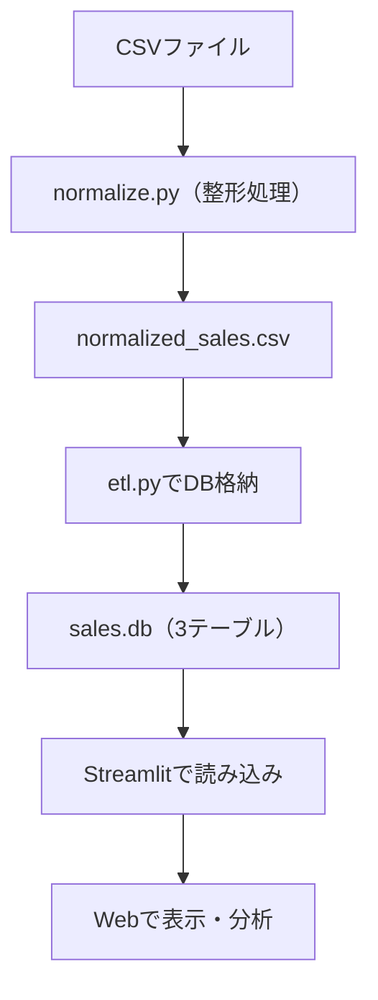
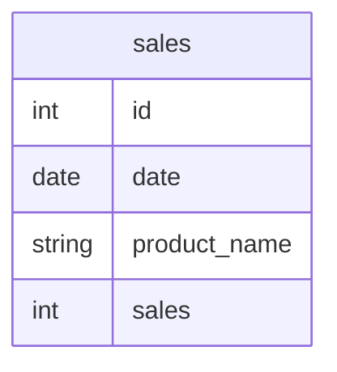

# 売上データETL＋可視化パイプライン｜非エンジニアでも使える売上分析ツール

> **Excel・CSVで管理されたバラバラの売上データを一括統合・整形・可視化するETLパイプライン＆Streamlitアプリです。** 
> **実務でありがちな「日付形式の揺れ」「カラム名の不統一」「商品名の揺れ」などを自動処理し、誰でも使えるインターフェースを構築しました。**
複数店舗から届くバラバラな形式の売上CSVを自動で整形・統合し、SQLiteに格納。

非エンジニアでも1クリックで売上分析ができる軽量ダッシュボードを構築しました。
StreamlitによるWeb可視化で、現場でもすぐに活用できる仕組みを実現しています。


---

## 開発背景と目的

日々の売上データ管理において、以下のような課題が発生していました：

- 店舗・担当者ごとに異なるExcel形式で管理されており、手作業による統合が煩雑
- 日付や商品名、カラム名の表記ゆれにより、正しい集計が困難
- 可視化・分析の前段階で多くの時間が失われていた

そこで、**あらゆる形式の売上CSV・Excelファイルを自動で読み取り、統合・整形・可視化まで行えるETLパイプライン＆Streamlitアプリ**を開発しました。

### 課題
- 小売・飲食業など、複数店舗の売上集計ではCSV形式が統一されておらず、列名・日付形式・商品名にバラつきが生じやすい。
- 毎回Excelでの整形・集計作業が発生し、1ファイルにつき30分以上の作業時間と属人化が課題に。

### 解決アプローチ
- PythonスクリプトでCSVを自動整形・正規化し、SQLiteへ格納。
- Streamlitを使ってWebアプリ化することで、非エンジニアでも分析可能なUIを提供。

### 成果
- 毎回Excelで同じような手作業を繰り返していたので、自動化して秒で終わるようにしました。
- 他の人にも使ってもらえるよう、誰でも扱えるツールに仕上げました。
- 分析環境をコードレスで提供し、店舗側でも売上状況を可視化可能に。
---

## 使用技術と選定理由

| 技術       | 用途                         | 選定理由 |
|------------|------------------------------|----------|
| Python     | ETL処理の実装                | pandasによる柔軟なデータ加工に最適 |
| pandas     | データ整形・正規化           | 実務でも使用頻度が高く、学習・保守が容易 |
| Streamlit  | UI開発・可視化               | 非エンジニアでも使いやすいWebUIを高速構築可能 |
| SQLite     | データ格納用DB（軽量）       | デモ用途に適した簡易DB。PostgreSQL等にも移行可 |
| GitHub     | バージョン管理・公開         | 公開ポートフォリオとして活用 |


---

## ディレクトリ構成

```plaintext
Sales-etl-streamlit/
├── data/            # 元データCSV格納用
├── db/              # SQLite DB格納先
├── normalize.py     # CSV整形スクリプト
├── etl.py           # DB格納スクリプト
├── app.py           # Streamlitアプリ
├── requirements.txt # 使用ライブラリ一覧
└── README.md        # 本ドキュメント
```

---

## ETL処理フロー



## 実行方法（ローカル環境）

1. リポジトリをクローン

```bash<br>git clone ...
git clone https://github.com/flopsy212/Sales-etl-streamlit.git
cd Sales-etl-streamlit
```

2. ライブラリをインストール 
  ```
pip install -r requirements.txt
```

3. データ整形（CSV → 正規化CSV）
```
python normalize.py
```

 4. SQLiteデータベースへの格納
```
python etl.py
```

 5. Streamlitアプリを起動
```
streamlit run app.py
```

## アプリ画面イメージ


## 構成図


---

### ER図とデータ例

```markdown
## ER図とデータ例

### データの変換前（例）
| 日付       | 商品名     | 売上 |
|------------|------------|------|
| 2024年3月1日 | コーヒー（大） | 1000 |
| 03/02/2024 | コーヒー大     | 1100 |

### データ変換後（統一形式）
| date       | product_name | sales |
|------------|--------------|-------|
| 2024-03-01 | コーヒー      | 1000 |
| 2024-03-02 | コーヒー      | 1100 |
```

### ER図（Mermaid形式）


## 工夫したポイント

- 表記ゆれ対応**：商品名・カラム名を辞書マッピングや正規表現で統一
- 日付整形**：和暦、スラッシュ区切り、年月形式などを一括変換
- ファイル一括アップロード**：複数Excel/CSVを同時処理
- Streamlitによる即時確認UI**：結果をすぐに表・グラフで確認可能
- 再利用性の高いETLロジック**：後続業務やBIツール連携も意識した構成

## インフラ構成図
[User] --> [Streamlit UI] --> [ETL処理（Python）] --> [DB(SQLite)] --> [Table表示]

## 成果

| 項目         | 導入前            | 導入後            |
|--------------|-----------------------------|-----------------------------|
| 作業時間     | 30分/ファイル               | 数秒で完了（バッチ処理）   |
| 担当範囲     | 手作業の属人化              | 誰でも使えるツール化       |
| エラー発生率 | ファイルごとに手修正ミス発生 | 自動処理でミス激減         |

> 特に、CSVの形式が毎回変わるために毎回対応が必要だったが、正規化ルールを整備したことで形式が違っても処理できるようになったのが大きい成果だった。

## 今後の展望

- Docker化・クラウド移行（GCP / AWS / Railway）
- PostgreSQL等RDBMS対応
- AirflowによるETLスケジューリング
- BIツール（Looker / Metabase）連携


[Qiita記事](https://qiita.com/flopsy_tech/items/def6a3f746bfd440c3f6)
[GitHubプロフィール](https://github.com/flopsy212)
