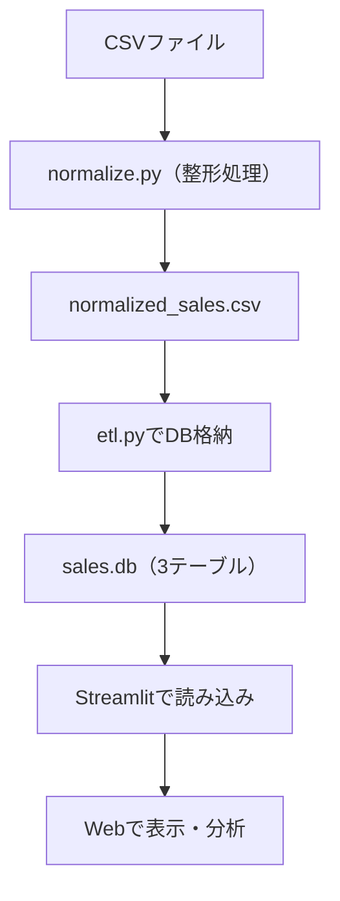

# 🧾 売上データETL＋可視化パイプライン｜非エンジニアでも使える売上分析ツール

複数店舗から届くバラバラな形式の売上CSVを自動で整形・統合し、SQLiteに格納。
非エンジニアでも1クリックで売上分析ができる軽量ダッシュボードを構築しました。
StreamlitによるWeb可視化で、現場でもすぐに活用できる仕組みを実現しています。


---

## 📌 背景と目的

### 💡 課題
- 小売・飲食業など、複数店舗の売上集計ではCSV形式が統一されておらず、列名・日付形式・商品名にバラつきが生じやすい。
- 毎回Excelでの整形・集計作業が発生し、1ファイルにつき30分以上の作業時間と属人化が課題に。

### 🔧 解決アプローチ
- PythonスクリプトでCSVを自動整形・正規化し、SQLiteへ格納。
- Streamlitを使ってWebアプリ化することで、非エンジニアでも分析可能なUIを提供。

### ✅ 成果
- 作業時間を30分 → 数秒に短縮。
- 手作業ミスを削減し、誰でも同じ処理ができるよう業務を標準化。
- 分析環境をコードレスで提供し、店舗側でも売上状況を可視化可能に。

---

## 🛠 使用技術

- Python（pandas）
- SQLite
- Streamlit
- Altair
- Mermaid（構成図作成）

---

## 📁 ディレクトリ構成

```plaintext
Sales-etl-streamlit/
├── data/            # 元データCSV格納用
├── db/              # SQLite DB格納先
├── normalize.py     # CSV整形スクリプト
├── etl.py           # DB格納スクリプト
├── app.py           # Streamlitアプリ
├── requirements.txt # 使用ライブラリ一覧
└── README.md        # 本ドキュメント
```

---

## 🔄 ETL処理フロー



## 🚀 実行方法（ローカル環境）

1. リポジトリをクローン

```bash<br>git clone ...
git clone https://github.com/flopsy212/Sales-etl-streamlit.git
cd Sales-etl-streamlit
```

2. ライブラリをインストール 
  ```
pip install -r requirements.txt
```

3. データ整形（CSV → 正規化CSV）
```
python normalize.py
```

 4. SQLiteデータベースへの格納
```
python etl.py
```

 5. Streamlitアプリを起動
```
streamlit run app.py
```

## 📷 アプリ画面イメージ


## 💬 今後の展望

- ✅ DWH対応（BigQueryなど）
- 🔄 ETL自動化（Airflow、Cron）
- 📊 KPI・ランキング分析などダッシュボード拡張
- 📡 API連携でPOSデータ等の外部データ取り込み
- ☁️ クラウド環境対応（AWS Lambda / GCSなど）
- 🧠 売上予測モデルの実装（scikit-learn）

[Qiita記事](https://qiita.com/flopsy_tech/items/def6a3f746bfd440c3f6)
[GitHubプロフィール](https://github.com/flopsy212)
